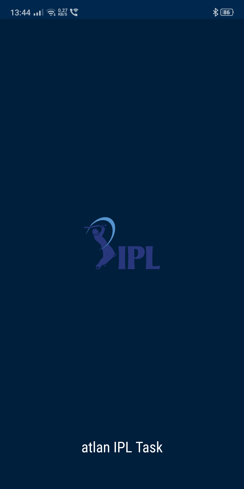
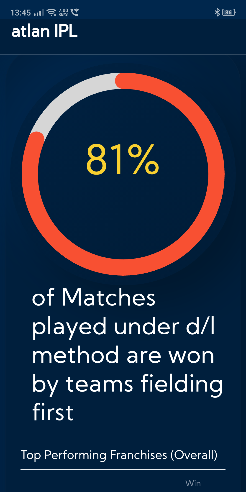

# IPL Dashboard for Vipul (Not an IPL Fan)

## List of all major libraries utilised in the application:
1. ReactJS:
    + Since a **lot of logic** (for processing matches data) is scripted across the application, with React it became **easy to break it down**.
    + Being a **data intensive application**, the ability of React to create a **Virtual DOM** makes changes reflect quickly.
    + Great **debugging tools** in devtools, right off the bat.

2. Webpack
    + I wanted to ensure **maximum configurability** and thus built it with custom webpack & babel setup instead of CRA.
    + It helped in setting service workers, inbuilt conversion of scss to css & source-map for tracing etc. 

3. Express
    + Used for **creating server** for dynamic hosting of web app on **firebase hosting**.
    + Enabled **Cache-Control** in server response.

4. Bootstrap: For quick styling

5. Lodash: **Utility functions** helped in making the code readable & easy to fix.

## Highlights

1. Optimizing loading time ✅
    + I have added **fallback fonts in CSS** font-family to ensure that the text remains visible during the webfont load (Kumbh Sans in my case). This **improved the FCP Score**.
    + With **React's Virtual DOM**, rendering components is fast & thus the **LCP Score** for the dashboard is fast.
    + **Caching with Service worker** improved performance on subsequent loads.
    + Although the dashboard uses animations, I ensured **no major Layout shifts** & thus CLS is just 0.001.
    > Lighthouse Performance Score: 92

2. Mobile responsive ✅ 
    + I have utilised bootstrap classes for flex & grid displays along with media queries at a few places
    + Table used in dashboard is also responsive.
    + I have avoided absolute sizing of fonts/containers wherever possible & instead used ***em*** & ***rem***
    > Responive across Desktop, Tablets & Mobile Phones

3. Progressive Web App ✅
    + Installable
        - Uses HTTPS: Hosted on firebase hosting [`functions/index.js`]
        - Service worker registered: Using <a href="https://www.npmjs.com/package/workbox-webpack-plugin">workbox-webpack-plugin</a> [`build/webpack.config.client.prod.js`]
        - Correct web app manifest: Using <a href="https://www.npmjs.com/package/webpack-manifest-plugin">webpack-manifest-plugin</a> [`build/webpack.config.client.prod.js`]

    + PWA Optimized
        - Enforces HTTPS using <a href="https://www.npmjs.com/package/express-sslify">express-sslify</a> [`functions/index.js`]
        - Icon with size 512x512 available for splash screen in android devices along with maskable icon for app icon.
        - Added `theme-color` in `manifest.json`
        - Content without JS availability also present

    + Fast & Reliable
        - Page load is fast on mobile networks.
    >Lighthouse PWA Score: Installable & PWA Optimized

4. Offline Usable ❌ 
    + Tried everything but just didn't work out.
    + Unable to fetch `app.bundle.js` from service worker cache
    + Help would be appreciated.

## Other Notes
1. Neumorphic UI
2. **No data is hardcoded but is evaluated**. Check out [`app/utils/factsGenerator.js` & `app/utils/statsGenerator.js`]

## Live Links
1. Repository: https://github.com/git-shashwat/ipl-dashboard
2. <a href="https://atlan-task-d55a8.web.app/">Application</a>

## Screenshots

    
    

